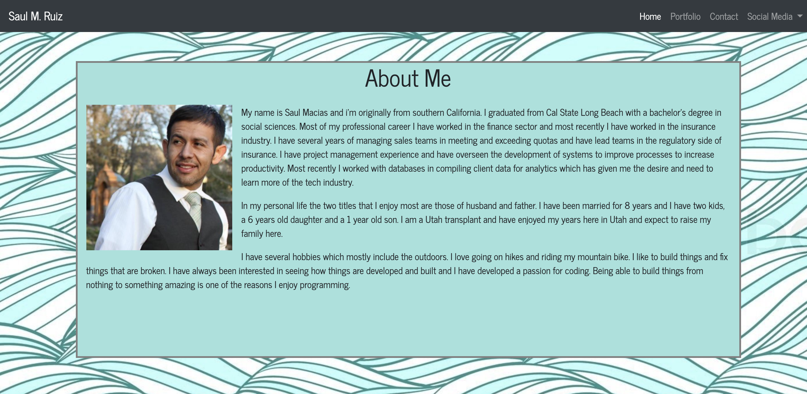

# Responsive-Portfolio

Responsive portfolio is a website developed using bootstrap layouts and bootstrap conponets. The website is designed to be reponsive and accessible on both desktop and mobil devices. 

[Responsive portfolio](https://sm-801.github.io/responsive-portfolio/). Is hosted on github pages. 

